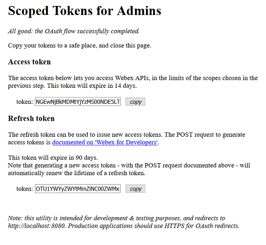
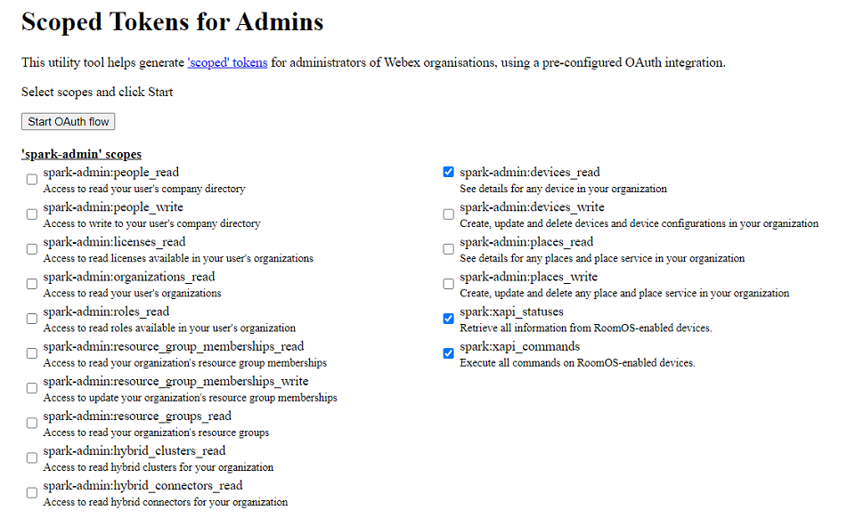

# Scoped Tokens issuer for Webex Administrators [](https://developer.cisco.com/codeexchange/github/repo/ObjectIsAdvantag/webex-integration-admin)

A sample web application that generates scoped tokens for an Webex Organization administrator.



The applicatio comes in 2 flavors:
- [dynamic](server.js): select from a list of 'spark-admin' scopes (default mode and illustrated below)
- [static](static.js): start straight from the hard-coded list of scopes




This sample is configured with a pre-defined [Webex OAuth Integration](https://developer.webex.com/docs/integrations) that includes all Webex scopes (except spark:all), and redirects to http://localhost:8080/oauth so that Webex Administrators can quickly generate 'scoped' OAuth access tokens on their local machine.

For production purpose, you would typically create your own OAuth integration from the Webex for Developers portal. You would also deploy your integration over HTTPS.

To learn more about the implementation details of this Webex OAuth integration, check the DevNet learning lab: [Run a Webex Teams Integration locally](https://developer.cisco.com/learning/tracks/collab-cloud/spark-apps/collab-spark-intl/step/1).


## Run the sample locally

``` bash
git clone https://github.com/ObjectIsAdvantag/webex-integration-admin
cd webex-integration-admin
npm install
DEBUG=oauth* node server.js
```

You're all set, the integration is ready to use.

Open [http://localhost:8080](http://localhost:8080) in a Web browser.

Select scopes in the proposed list, 
and Click the 'Start' button


## Customize the scoped tokens

Use the `static.js` service to launch an application with a pre-defined list of scopes.

To define the list of scopes requested: 
- open the `.env` file and update the SCOPES varialbe, 
- or specify custom scopes on the command line

**Example to request custom compliance scopes**

Run the command below in a bash terminal:

```
DEBUG=oauth* SCOPES="spark-compliance:rooms_read spark-compliance:teams_read spark-compliance:events_read"  node static.js
```


## Registering your own OAuth Integration

To learn more about Webex Integrations, [read the reference documentation](https://developer.webex.com/authentication.html).

In the example above, we were running a pre-registered OAuth integration running on port 8080.
Let's now see how to create your own Webex integration that we will be running on port **9090** for example.

Go to the [Webex for developers](https://developer.webex.com) portal, click 'Apps', 'add Apps', and then [create an integration](https://developer.webex.com/add-integration.html).

Fill the form fields:
- **Name**: your app name, such as 'My Awesome App' in the snapshot below,
- **Description**: these details are not displayed to your app end-users,
- **Support email**: a valid email address for Webex Spark operations team to reach to you if necessary,
- **App Icon**: simply pick one of the default icons or upload a 512x512 file. Feel free to use this provided sample for now: [https://bit.ly/SparkIntegration-512x512](https://bit.ly/SparkIntegration-512x512)
- **Redirect URI**: enter `http://localhost:9090/oauth` since this is the URL at which the provided code sample will be listening on your local machine. More to come in the next steps if this lab
- **Scopes**: select all scopes but spark:all.

> Note the list of scopes you selected corresponds to the maximum set of scopes that your integration will be entitled to ask for. However, from code, your integration can dynamically [refine the set of scopes asked for](https://github.com/CiscoDevNet/webex-integration-sample/blob/master/server.js#L30) in order to comply with the real needs of your application.

A good practice is to start small and extend the set of scopes asked for as the end-users gain trust in your app and is ready to ask more advanced features.

Click save, and look for your integration `client id` and `client secret`.


Let's now configure the integration: you can either paste your integration client id and secret into [the code](https://github.com/CiscoDevNet/webex-integration-sample/blob/master/server.js#L26), or set these as env variables on the command line.

Instructions for **Mac, Linux and Windows bash users** 
- open a terminal
- on a single command line, type:

    ```shell
    DEBUG=oauth* PORT=9090 REDIRECT_URI="http://localhost:9090/oauth" CLIENT_ID="YOUR_INTEGRATION_ID" CLIENT_SECRET="YOUR_INTEGRATION_SECRET"  node server.js
    ```

Instructions for **Windows command shell users**
- open a command shell
- enter the commands below:

    ```shell
    set DEBUG="oauth*"
    set PORT=9090
    set REDIRECT_URI="http://localhost:9090/oauth"
    set CLIENT_ID="YOUR_INTEGRATION_ID"
    set CLIENT_SECRET="YOUR_INTEGRATION_SECRET"
    node server.js
    ```

**You're all set. Restart your integration, and give it a try: [http://localhost:9090](http://localhost:9090)**


This step by step guide explained how to register a Webex Integration running on a local developer environment.
In the real-world, you will want to deploy your integration over HTTPS, and register its public URL rather than your local machine's.

Check the DevNet learning lab: ['Deploy a Webex OAuth Integration'](https://developer.cisco.com/learning/lab/collab-spark-intd-heroku/step/1) for detailled instructions.


## More about Webex Integrations

Webex Integrations are a way for your apps to request permission to invoke the Webex APIs on behalf of Webex Teams users. 
The process used to request permission is called an OAuth Grant Flow, and is documented in the [Integrations guide](https://developer.webex.com/docs/integrations).

You can experiment the flow in DevNet Learning lab ["Understand the OAuth Grant flow of Webex Teams Integrations"](https://learninglabs.cisco.com/tracks/collab-cloud/business-messaging/collab-spark-auth/step/1).
